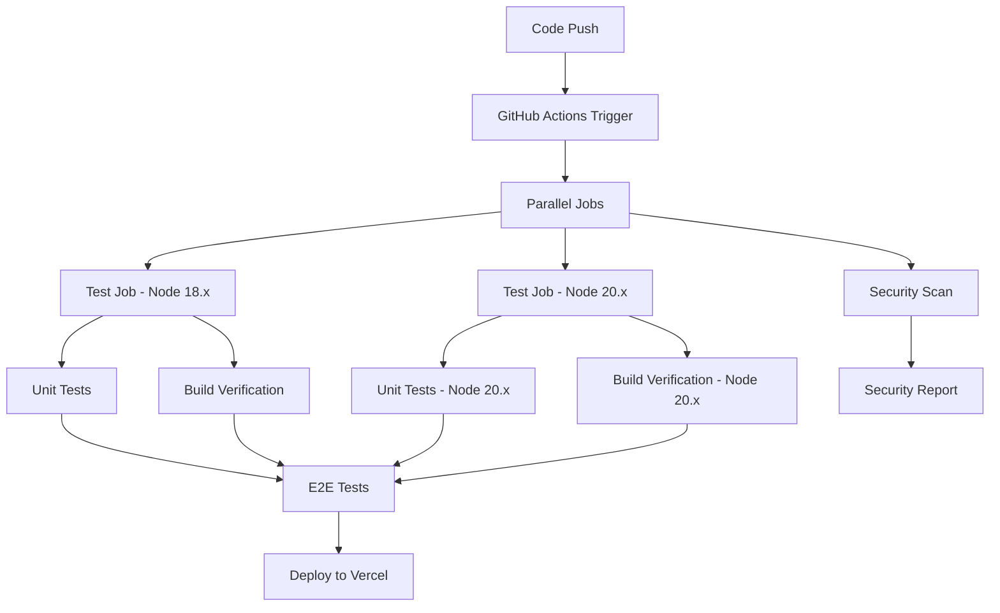

# Design Document

## Overview

This design addresses the failing GitHub Actions CI/CD pipeline by implementing systematic fixes for test execution, deployment workflows, and code quality checks. The solution focuses on resolving the current failing checks: CI/test (18.x), Deploy to Production/deploy-vercel, while maintaining the successful security-scan check.

## Architecture

### Current Pipeline Analysis
- **CI/test (18.x)**: Failing after 1m - likely due to test timeouts or mock configuration issues
- **Deploy to Production/deploy-vercel**: Failing after 1m - likely due to build or environment configuration issues
- **CI/test (20.x)**: Cancelled after 1m - dependency on 18.x test failure
- **CI/security-scan**: ✅ Successful - no changes needed
- **CI/e2e-test**: Skipped - depends on test job completion

### Solution Architecture



## Components and Interfaces

### 1. Test Configuration Component
**Purpose**: Ensure reliable test execution across different Node.js versions

**Key Elements**:
- Mock configuration standardization
- Test timeout management
- Environment variable setup for tests
- Test isolation and cleanup

### 2. Build Process Component
**Purpose**: Standardize build process for consistent deployment artifacts

**Key Elements**:
- Vite configuration optimization
- Environment-specific build commands
- Dependency resolution
- Build artifact validation

### 3. Deployment Configuration Component
**Purpose**: Ensure successful deployment to Vercel

**Key Elements**:
- Environment variable management
- Build output configuration
- Deployment verification
- Rollback mechanisms

### 4. Code Quality Component
**Purpose**: Maintain code quality without blocking CI

**Key Elements**:
- ESLint configuration refinement
- Prettier integration
- Pre-commit hooks
- Quality gate thresholds

## Data Models

### Test Configuration Model
```javascript
{
  testTimeout: number,
  mockConfiguration: {
    services: string[],
    globals: object
  },
  environment: {
    NODE_ENV: string,
    testSpecificVars: object
  }
}
```

### Build Configuration Model
```javascript
{
  nodeVersion: string,
  buildCommand: string,
  outputDirectory: string,
  environmentVariables: object,
  buildArtifacts: string[]
}
```

### Deployment Configuration Model
```javascript
{
  platform: 'vercel' | 'netlify',
  environment: 'production' | 'staging',
  secrets: string[],
  buildSettings: object,
  deploymentChecks: string[]
}
```

## Error Handling

### Test Failures
- **Timeout Errors**: Increase timeout limits and optimize slow tests
- **Mock Errors**: Standardize mock implementations and imports
- **Environment Errors**: Ensure consistent environment setup

### Build Failures
- **Dependency Errors**: Lock dependency versions and use npm ci
- **Configuration Errors**: Validate build configurations
- **Resource Errors**: Optimize build process for CI environment

### Deployment Failures
- **Authentication Errors**: Verify GitHub Secrets configuration
- **Build Artifact Errors**: Validate build outputs before deployment
- **Environment Errors**: Ensure all required environment variables are set

## Testing Strategy

### Unit Test Improvements
1. **Mock Standardization**: Create consistent mock patterns for services
2. **Test Isolation**: Ensure tests don't interfere with each other
3. **Performance Optimization**: Identify and optimize slow tests
4. **Error Handling**: Improve test error messages and debugging

### Integration Test Strategy
1. **Service Integration**: Test service integrations with proper mocks
2. **API Testing**: Ensure API endpoints work correctly
3. **Database Testing**: Mock database operations consistently

### E2E Test Strategy
1. **Environment Setup**: Ensure E2E tests run in isolated environment
2. **Test Data Management**: Use consistent test data
3. **Browser Testing**: Optimize browser automation for CI

## Implementation Phases

### Phase 1: Test Stabilization
- Fix failing unit tests
- Optimize test performance
- Standardize mock configurations
- Ensure test isolation

### Phase 2: Build Process Optimization
- Optimize Vite configuration for CI
- Standardize build commands
- Improve dependency management
- Add build verification steps

### Phase 3: Deployment Pipeline Fixes
- Fix Vercel deployment configuration
- Verify environment variables
- Add deployment health checks
- Implement rollback procedures

### Phase 4: Code Quality Integration
- Refine ESLint configuration
- Add automated formatting
- Implement quality gates
- Add pre-commit hooks

## Success Metrics

- All GitHub Actions checks pass consistently
- Test execution time under 2 minutes
- Deployment success rate > 95%
- Zero security vulnerabilities
- Code quality scores maintained